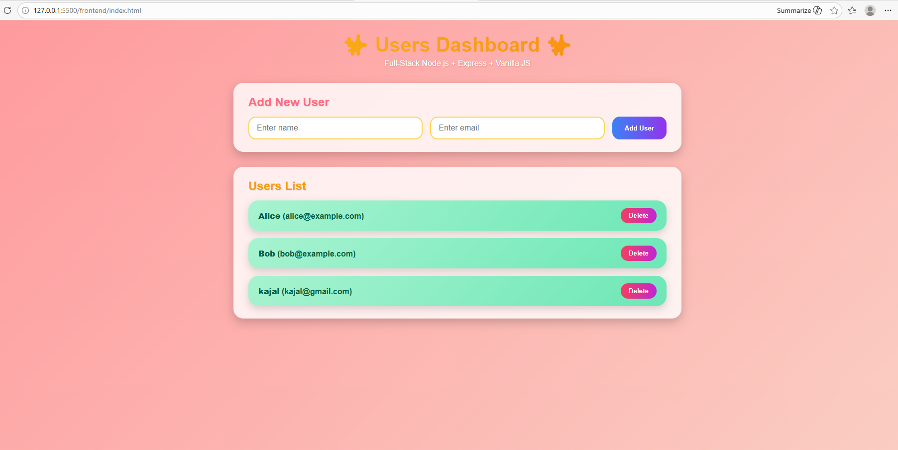

# Full-Stack Node.js User Management App

 <!-- Replace with your actual screenshot -->

## Overview

This is a **full-stack web application** built using **Node.js, Express, HTML, CSS, and Vanilla JavaScript**.  
It demonstrates a **dynamic user management system** with **CRUD operations** (Create, Read, Update, Delete).  

The project is designed to help learners understand **full-stack development** concepts, including REST APIs, frontend-backend integration, and responsive UI design.

---

## Project Structure
full-stack/
├── backend/
│ ├── server.js # Node.js + Express REST API
│ └── package.json # Backend dependencies
└── frontend/
├── index.html # Frontend UI layout
├── style.css # Vibrant styling
└── script.js # Dynamic fetch & DOM manipulation

---

## Features

- **REST API** using **Node.js + Express**  
- **CRUD operations** on users (`/users` endpoint)  
- **Dynamic frontend** fetching API data using **Fetch API**  
- Responsive UI with vibrant colors, gradient headers, and interactive user cards  
- Tested API endpoints with **Postman**  
- Modular project structure: `frontend` + `backend`

---

## Tech Stack

- **Backend:** Node.js, Express  
- **Frontend:** HTML, CSS, Vanilla JavaScript  
- **Tools:** VS Code, Postman, Git, GitHub  

---

## Setup Instructions

### 1. Clone the repository
bash
git clone https://github.com/kajalkamble0713-jpg/full-stack-node-project.git
cd full-stack

2. Setup Backend
cd backend
npm install

Start the backend server:
nodemon server.js
The backend will run on:
http://localhost:5000

3. Setup Frontend
Open frontend/index.html in your browser or use VS Code Live Server:
cd ../frontend

# Open index.html with Live Server
The frontend fetches data from the backend API and displays it dynamically.

Usage
Open the frontend in your browser.
Add new users using the form.
View the list of users dynamically displayed.
Delete users directly from the list.
Next Steps / Enhancements
Add database integration (MongoDB/MySQL) for persistent storage
Implement full update/edit functionality in the frontend
Add user authentication and validation

Project Demo

📽️ Watch the demo video: [Insert Link]
🔗 GitHub Repository:https://github.com/kajalkamble0713-jpg/full-stack-node-project.git

Author / Internship0
Internship: Level 1 Full-Stack Development at Codveda Technology
Name: KAJAL RAJENDRA KAMBLE
Domain: Full-Stack Web Development040

License
This project is for educational purposes during internship at Codveda Technology.

